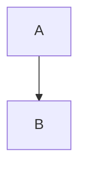
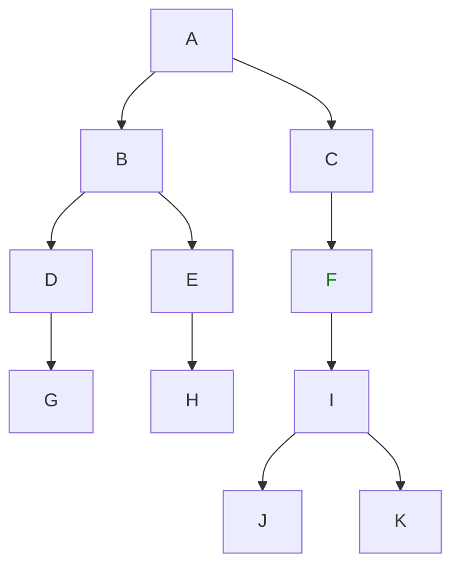
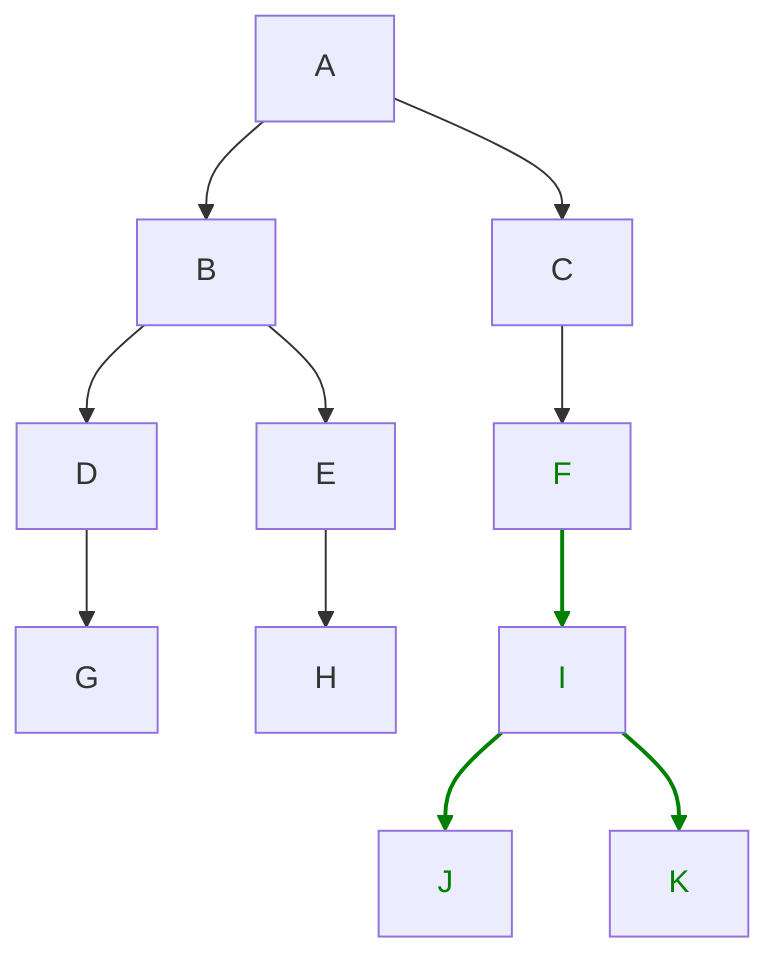
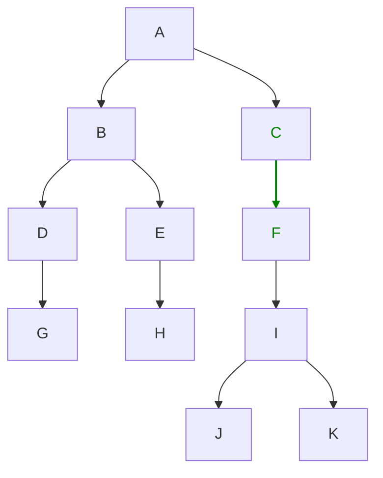
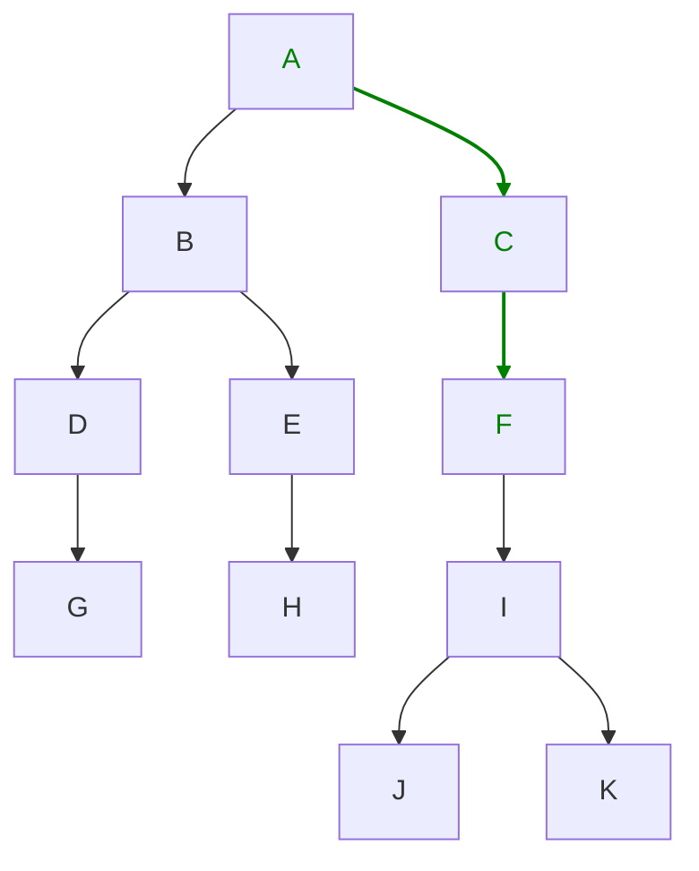

# Use Case List

List of use-cases and all usage-related options
needed to understand intent and full-feature set of Packager

## Dependencies

Each use-case is described by a simple mermaid diagram
which describes dependency graph of noted packages.

Green color indicates which packages will be built.

Arrows indicate dependency (build deps) between packages.
When package A depends on package B the following is written.



## Build Package - without Dependencies

Build single package (F) without any dependencies.

It expects all package dependencies are already build and installed into build
sysroot directory.



**Command**

```bash
packager --context ./example \
  --image-name debian \
  --name F \
  --output-dir ./git-lfs-repo
```

## Build Package - with Dependencies

Build all dependencies of the package (F) before the package (F) is build.



**Command**

```bash
packager --context ./example \
  --image-name debian \
  --name F \
  --build-deps \
  --output ./git-lfs-repo
```

## Build Package - with Depends on Packages

Build **the closest** packages which depends on the given package directly after the package is built.



**Command**

```bash
packager --context ./example \
  --image-name debian \
  --name F \
  --build-deps-on \
  --output ./git-lfs-repo
```


## Build Package - with Depends on Packages Recursive

Build **all** packages which depends on the given package (F) directly after the package is built.



**Command**

```bash
packager --context ./example \
  --image-name debian \
  --name F \
  --build-deps-on-recursive \
  --output ./git-lfs-repo
```

## Sysroot

When all packages are build and stored as part of `--output-dir` directory
The sysroot can be created.

The packager takes all archives for a given Image name and Architecture
and unzip them into the specified directory.

TODO: Does it preserve UNIX permissions?

## Consistency

Packager ensure the context directory (``--context``) is consistent with the
git-lfs repository for each image and architecture.

Detailed description of Consistency Check is available
in the [Consistency Check](ConsistencyCheck.md) document.

