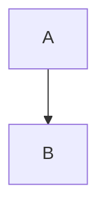
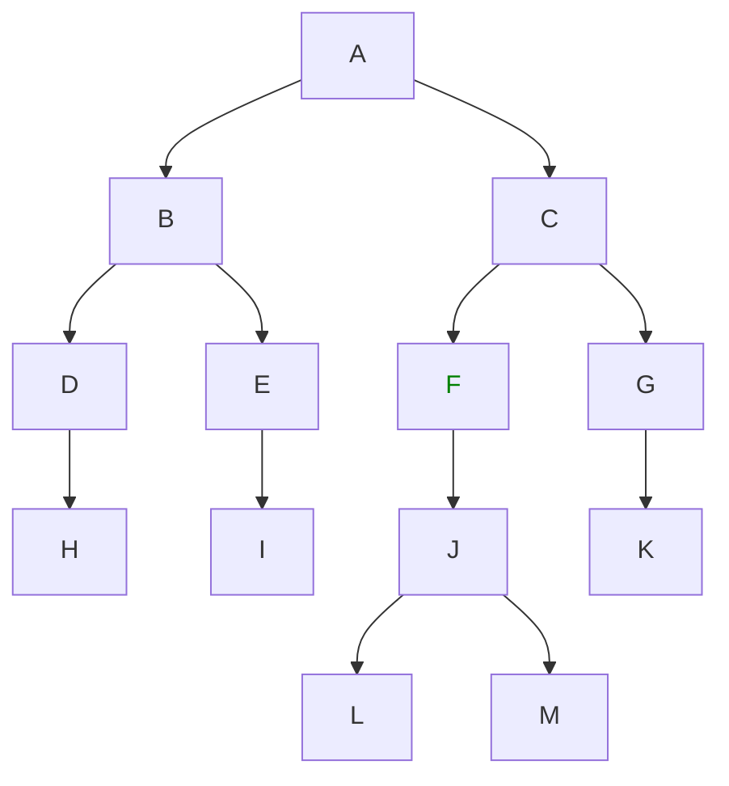
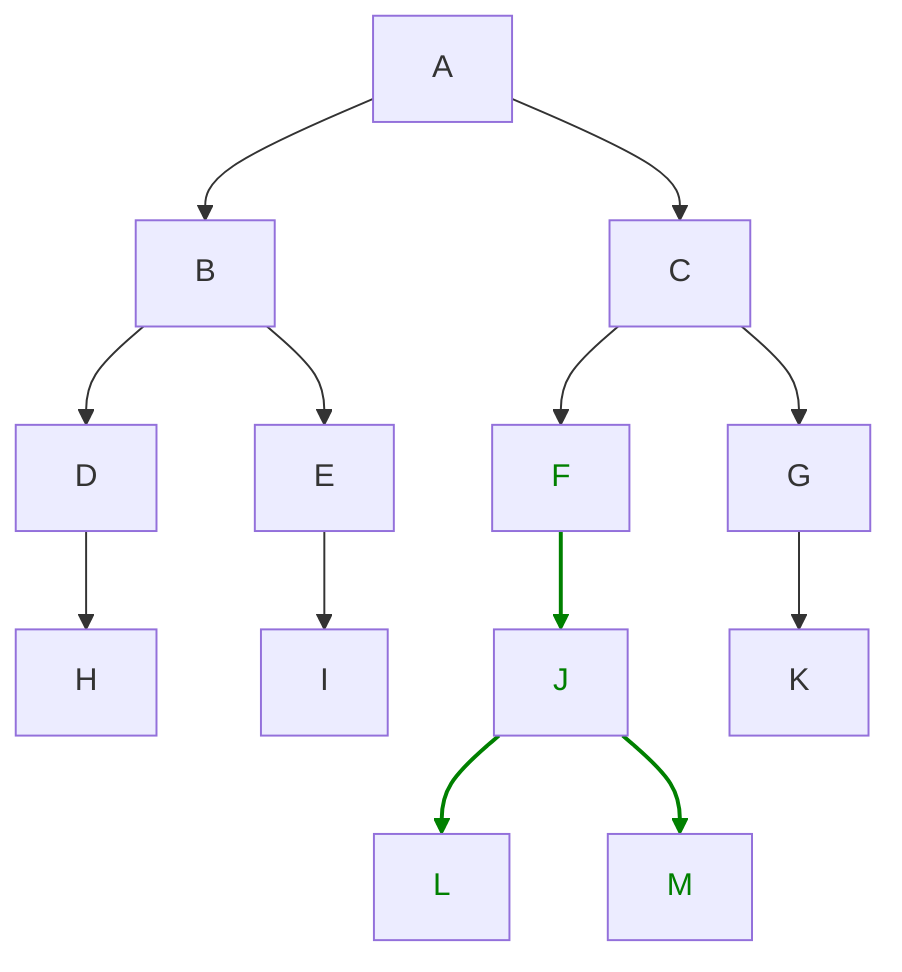
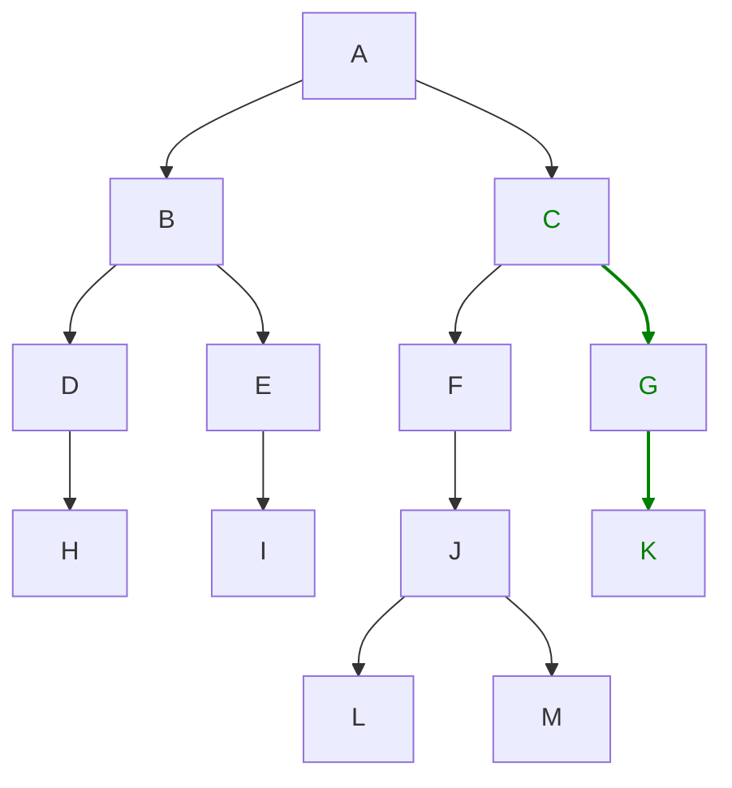
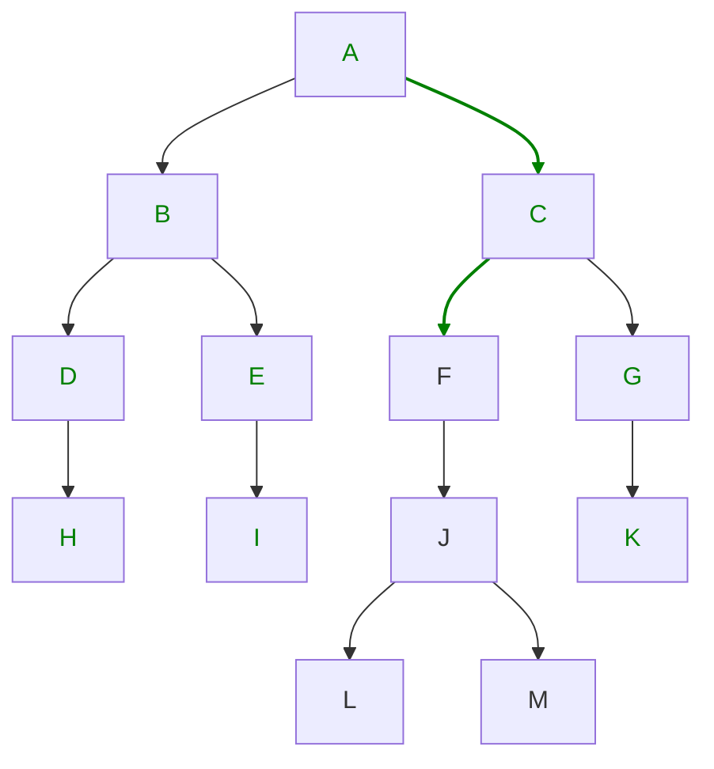

# Use Case List

List of use-cases and all usage-related options needed to understand intent and full-feature set
of Packager

## Build Package

### Dependencies

Each use-case is described by a simple mermaid diagram which describes dependency graph of noted
packages.

Green color indicates which packages will be built.

Arrows indicate dependency (build deps) between packages. When package A depends on package B the
following is written.



### Build Package - without Dependencies

Build single package (F) without any dependencies.

It expects all package dependencies are already build and installed into build sysroot directory.



**Command**

```bash
packager --context ./example \
  --image-name debian \
  --name F \
  --output-dir ./git-lfs-repo
```

### Build Package - with Dependencies

Build all dependencies (J, K, L) of the package (F) before the package (F) is build.



**Command**

```bash
packager --context ./example \
  --image-name debian \
  --name F \
  --build-deps \
  --output ./git-lfs-repo
```

### Build Package - with Depends on Packages

Build packages (C) which depends on package (F) with its dependencies (G, K) without package (F)
and its dependencies (J, L, M).



**Command**

```bash
packager --context ./example \
  --image-name debian \
  --name F \
  --build-deps-on \
  --output ./git-lfs-repo
```


### Build Package - with Depends on Packages Recursive

Build packages (C, A) which depends on package (F) recursively with its dependencies
(G, K, B, D, E, H, I) without package (F) and its dependencies (J, L, M).



**Command**

```bash
packager --context ./example \
  --image-name debian \
  --name F \
  --build-deps-on-recursive \
  --output ./git-lfs-repo
```

## Create Sysroot

When all packages are build and stored as part of `--output-dir` directory the sysroot can be
created.

The packager takes all archives for a given Image name and Architecture
and unzip them into the specified directory.

TODO: Does it preserve UNIX permissions?

**Command**

Creates sysroot from packages in Git Lfs for `debian` image in `new_sysroot/` directory.

```bash
packager create-sysroot
  --context ./example \
  --image-name debian \
  --git-lfs ./git-lfs-repo \
  --sysroot-dir new_sysroot
```
